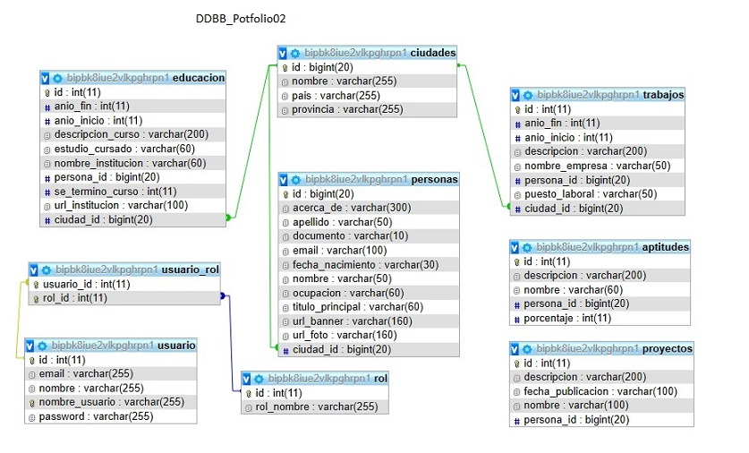

# Portfolio_Backend
Backend Portfolio Web - Curso Argentina Programa 
 - Primera versión de Portfolio Backend, con Java versión 8.
 - Estructura Base de datos: 

- Documentación: https://backporfolio.onrender.com/swagger-ui/index.html
